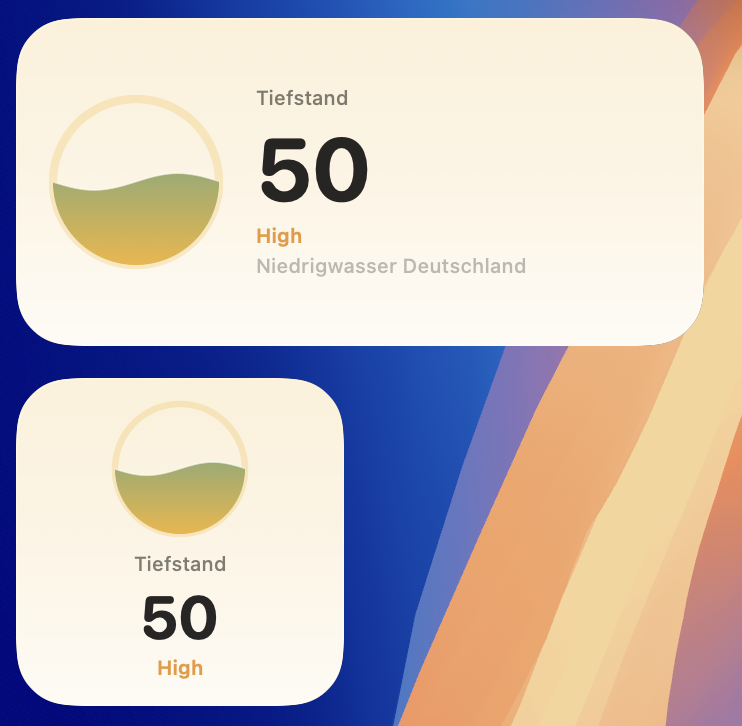

# 🅣 Tiefstand

**A native macOS menu-bar app that shows Germany's nationwide low-water situation as a single, color-coded number — with a local-gauge option.**

> *Tiefstand* (German): a water body's lowest level — and, figuratively, a low point.

Germany now has a nationwide low-water information system, [**NIWIS**](https://niwis-online.de/), launched by the Federal Institute of Hydrology (BfG) on 15 July 2026. *Tiefstand* distills its data into one glanceable metric that lives in your menu bar, so you always know how dry the country's rivers and groundwater are right now.

> ⚠️ **Work in progress.** Runs as a real menu-bar app with live NIWIS data and a WidgetKit desktop widget. Nearest-gauge (CoreLocation) and the Germany map are next. Built in the open.

<p align="center">
  
</p>

<p align="center">
  
</p>

<p align="center">
  
</p>

<p align="center"><sub>Live NIWIS data, 23 Jul 2026 — national Dryness Index 50 · “High.” Menu-bar item, popover dashboard and the WidgetKit desktop widgets (medium + small).</sub></p>

---

## What it does

- **Menu bar:** the national **Dryness Index (0–100)**, color-coded, as a wave-fill indicator.
- **Popover dashboard:** per-domain breakdown (discharge, groundwater, spring flow, water level), a Germany map, and your **local gauge** with its class, trend and current value.
- **Desktop widget:** the index at a glance via WidgetKit.
- **Local option:** automatically resolves the nearest discharge + groundwater station via your location, or pin a favorite.

## The Dryness Index

*Tiefstand* condenses NIWIS's four-level low-water classification into one transparent score:

```
severity(station) = { none: 0, low: 33, very low: 67, extremely low: 100 }
domainScore(d)     = mean severity across d's stations (excluding no-data)
DrynessIndex       = (domainScore(discharge) + domainScore(groundwater)) / 2
```

- **Discharge + groundwater, weighted 50/50** — two independent hydrological compartments ("surface" and "sub-surface"). Water level is deliberately excluded to avoid double-counting surface water; spring flow is shown in the dashboard but kept out of the headline (sparse, regional network).
- **The four classes are treated as equally spaced** (none/low/very low/extreme → 0/1/2/3). NIWIS classifies each station by percentile thresholds against the 1991–2020 WMO reference period, but the exact class boundaries aren't published — so equal spacing is a deliberate *minimum-assumption* choice rather than inventing severity weights the source can't justify. A mean also compresses the distribution by design; the per-domain donuts in the popover show the full spread behind the single number.
- The methodology is intentionally open so the number can be read, checked and challenged.

## Data sources

| | Source | Notes |
|---|---|---|
| Primary | [NIWIS](https://niwis-online.de/) (BfG) | Open reuse API, four-level classification, per-station trend, no auth |
| Fallback | [PEGELONLINE](https://www.pegelonline.wsv.de/) (WSV) | Documented, stable; binary low/normal/high |

A `DataProvider` protocol abstracts the source, so PEGELONLINE transparently takes over if the NIWIS API — open for reuse, but not yet accompanied by a public OpenAPI spec — changes shape.

**Well-behaved client.** *Tiefstand* reads only, polls at most every two hours, and sends an identifying `User-Agent` (`Tiefstand/0.1 (+this repo)`) so the BfG can attribute the traffic and reach out. Nothing is mirrored or redistributed — the app fetches the current national aggregate plus your local gauge, and nothing more.

## Architecture

- **Swift · SwiftUI · WidgetKit · CoreLocation**
- `DataProvider` protocol → `NIWISProvider` (primary) + `PEGELONLINEProvider` (fallback)
- Index computation is pure and unit-tested against live reference values.

## Download

Grab the latest build from [**Releases**](https://github.com/Nikolaibibo/tiefstand/releases), unzip it, and drag **Tiefstand.app** into your Applications folder. It lives in the menu bar (no Dock icon); quit it from the **•••** menu inside the popover.

**First launch.** The app isn't notarized yet (no paid Apple Developer account), so macOS flags it as coming from an unidentified developer. **Right-click the app → Open → Open** — once, and it remembers. Prefer the terminal? Clear the quarantine flag instead:

```bash
xattr -dr com.apple.quarantine /Applications/Tiefstand.app
```

A notarized `.dmg` that opens with a plain double-click will follow.

## Build from source

Requires macOS + Xcode (or the Swift toolchain).

```bash
git clone https://github.com/Nikolaibibo/tiefstand.git
cd tiefstand
swift test              # run the TiefstandCore suite
Scripts/make-app.sh     # assemble build/Tiefstand.app and code-sign it
open build/Tiefstand.app
```

> `make-app.sh` wraps the SwiftPM release binary into a real `.app` bundle (`LSUIElement`, ad-hoc signed) — no Xcode project and no paid Apple Developer account required. A notarized `.dmg` release will follow; until then, build from source.

### The desktop widget (Xcode)

`swift build` compiles the widget's code and tests, but a WidgetKit extension only *registers* with macOS when built through Xcode's signing/provisioning flow — a hand-assembled, ad-hoc-signed `.appex` is silently ignored by `pkd`. So the widget is the one part that goes through Xcode. To keep the repo free of a hand-maintained `.xcodeproj`, the project is generated from `project.yml` ([XcodeGen](https://github.com/yonaskolb/XcodeGen)):

```bash
brew install xcodegen                 # once
export DEVELOPMENT_TEAM=XXXXXXXXXX     # your 10-char team id (see below)
xcodegen generate                     # writes Tiefstand.xcodeproj (gitignored)
open Tiefstand.xcodeproj               # then Product → Run (⌘R)
```

Running it once registers the widget; add it via right-click desktop → **Edit Widgets** → **Tiefstand** (small or medium). Signing uses automatic provisioning — a **free** Apple ID works. Find your team id with `security find-identity -v -p codesigning` (the 10-char code in parentheses) or Xcode → Settings → Accounts; `project.yml` reads it from the `DEVELOPMENT_TEAM` environment variable so it stays out of the repo. A paid account is only needed for a notarized release that runs on other people's Macs.

## Roadmap

- [x] Data layer: `DataProvider` protocol + NIWIS client + models
- [x] Dryness Index + unit tests against live reference
- [x] Menu-bar item (wave-fill glyph + number)
- [x] Popover dashboard (index + per-domain donuts + local station)
- [x] App bundle (`LSUIElement`) so it runs as a real menu-bar app
- [ ] Nearest gauge via CoreLocation + Germany map in the popover
- [x] WidgetKit desktop widget (small + medium, shared wave-gauge)
- [ ] PEGELONLINE fallback provider
- [ ] Hydro visual polish (light/dark)
- [x] README screenshots (menu bar · popover · widget)
- [ ] Demo GIF, notarized release, landing page

## Attribution & license

Water data © [NIWIS / Bundesanstalt für Gewässerkunde (BfG)](https://niwis-online.de/) and the respective federal-state authorities, and © [WSV / PEGELONLINE](https://www.pegelonline.wsv.de/). Used with attribution per the sources' terms (exact data-license designation to be confirmed with the BfG). *Tiefstand* is an independent project and is not affiliated with or endorsed by the BfG or WSV.

Code licensed under the [MIT License](./LICENSE).
