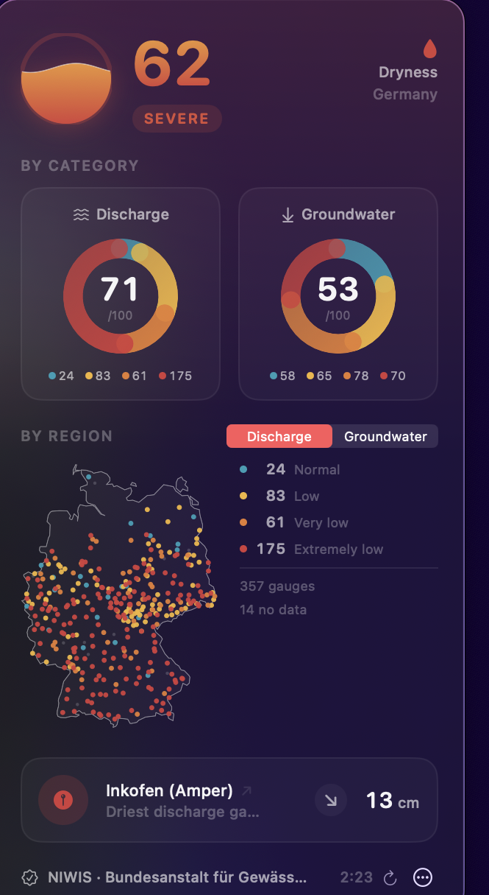
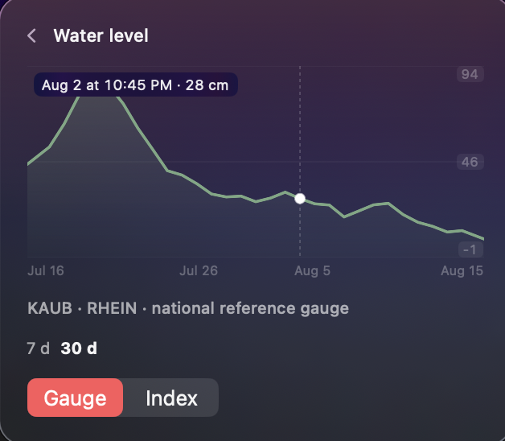
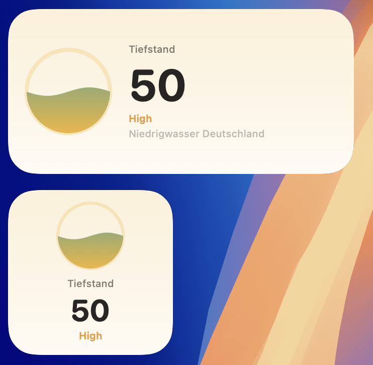

# 🅣 Tiefstand

**A native macOS menu-bar app that shows Germany's nationwide low-water situation as a single, color-coded number — with a local-gauge option.**

> *Tiefstand* (German): a water body's lowest level — and, figuratively, a low point.

Germany now has a nationwide low-water information system, [**NIWIS**](https://niwis-online.de/), launched by the Federal Institute of Hydrology (BfG) on 15 July 2026. *Tiefstand* distills its data into one glanceable metric that lives in your menu bar, so you always know how dry the country's rivers and groundwater are right now.

> ⚠️ **Work in progress.** Runs as a real menu-bar app with live NIWIS data, a 7/30-day history view and a WidgetKit desktop widget. Nearest-gauge (CoreLocation) and the Germany map are next. Built in the open.

<p align="center">
  
</p>

<p align="center">
  
</p>

<p align="center">
  
</p>

<p align="center">
  
</p>

<p align="center"><sub>Live data, 15 Aug 2026 — index 62 · “Severe”, the driest day on record outside 2018 and 2022. Popover dashboard with all 357 discharge gauges, the history view (Kaub/Rhein falling from 94 to −1 cm over 30 days), the WidgetKit desktop widgets and the menu-bar item.</sub></p>

---

## What it does

- **Menu bar:** the national **Dryness Index (0–100)**, color-coded, as a wave-fill indicator.
- **Popover dashboard:** per-domain breakdown, a **map of all 357 gauges** coloured by low-water class — point at one for its reading — and your **local gauge** with its class, trend and current value.
- **Gauge records:** click any dot on the map for that station's own daily series, with its low-water class boundaries drawn behind it — you can watch a river cross into *extremely low* instead of being told that it did.
- **History:** click the index to switch to a trend view — **7 days to 12 months** — the national index with **discharge and groundwater plotted underneath it**, so you can see which compartment is driving the number, plus the Rhine reference gauge at Kaub on its own tab.
- **Desktop widget:** the index at a glance via WidgetKit.
- **Local option:** automatically resolves the nearest discharge + groundwater station via your location, or pin a favorite.

## The Dryness Index

*Tiefstand* condenses NIWIS's four-level low-water classification into one transparent score:

```
severity(station) = { none: 0, low: 33, very low: 67, extremely low: 100 }
domainScore(d)     = mean severity across d's stations (excluding no-data)
DrynessIndex       = (domainScore(discharge) + domainScore(groundwater)) / 2
```

- **Discharge + groundwater, weighted 50/50** — two independent hydrological compartments ("surface" and "sub-surface"). Water level is deliberately excluded to avoid double-counting surface water; spring flow is shown in the dashboard but kept out of the headline (sparse, regional network).
- **The four classes are treated as equally spaced** (none/low/very low/extreme → 0/1/2/3). NIWIS classifies each station by percentile thresholds against the 1991–2020 WMO reference period. Those boundaries are not published as a table — but the portal's charting endpoint returns them with every request, one daily curve per class, which is how the calibration below was possible. A mean also compresses the distribution by design; the per-domain donuts and the map show the spread behind the single number.
- The methodology is intentionally open so the number can be read, checked and challenged.

### The bands are calibrated, not split at the quarters

A score means nothing without knowing what range it occupies. The first releases cut 0–100 into four equal bands at 25/50/75, and that was wrong: a mean of severity classes across hundreds of gauges does not use its upper range.

Reconstructing the national index from NIWIS daily station records for **2000–2026** — measurement against daily class boundary, aggregated the same way the app does it live — gives yearly maxima like this:

```
2022 ████████████████████ 64        2003 ███████████ 37
2018 ██████████████████ 60          2015 ██████████ 35
2026 ██████████████████ 59          2013 ███ 10
2020 ████████████████ 52            2024 ███ 11
```

**The index peaked at 64 and never reached 75 in twenty-seven years.** "Severe" was not rare; it was unreachable, and the driest days in a generation were reported as "High" with an empty band above them.

The thresholds are now **27 / 38 / 52** — the 75th, 90th and 98th percentiles of that reconstruction — chosen against a criterion you can argue with rather than only compute: *the droughts people remember must register, and ordinary years must not.* They put 2018, 2022, 2025 and 2026 into `Severe` and leave 2013 and 2024 in `Normal`.

The colour ramp is anchored to the same edges, so colour and label change together. Equal steps in the index deliberately do not give equal steps in colour: 10 → 20 is weather, 50 → 60 is a national event.

Method, validation against the live aggregate, and five named caveats: [`docs/superpowers/specs/2026-08-15-band-calibration.md`](docs/superpowers/specs/2026-08-15-band-calibration.md).

## Data sources

| | Source | Notes |
|---|---|---|
| Primary | [NIWIS](https://niwis-online.de/) (BfG) | Open reuse API, four-level classification, per-station trend, no auth |
| Gauge records | NIWIS `infodiagramm` | Daily station values back to 1991, **with the low-water class boundaries** — reverse-engineered from the portal, not in any published spec. One request per gauge, on demand. |
| Fallback + 30-day history | [PEGELONLINE](https://www.pegelonline.wsv.de/) (WSV) | Documented, stable; binary low/normal/high. Also the **only** source of real history — a rolling 30 days of water level at 15-minute resolution |

A `DataProvider` protocol abstracts the source, so PEGELONLINE transparently takes over if the NIWIS API — open for reuse, but not yet accompanied by a public OpenAPI spec — changes shape.

**Well-behaved client.** *Tiefstand* reads only, polls at most every two hours, and sends an identifying `User-Agent` (`Tiefstand/0.1 (+this repo)`) so the BfG can attribute the traffic and reach out. Nothing is mirrored or redistributed — the app fetches the current national aggregate plus your local gauge, and nothing more.

**Where the history comes from.** The two curves in the history view have opposite origins. Gauge history is PEGELONLINE's `measurements.json`, which serves a rolling 30-day window at 15-minute resolution — requested **only when you open the history view**, never on a timer, and cached for an hour; the gauge list is cached on disk for 30 days. The Dryness Index has no upstream history at all, because NIWIS publishes only the current aggregate, so the app records its own sample after each refresh and keeps 400 days of them locally. That curve therefore starts empty and fills in; the view says so rather than showing a blank chart.

**Why Kaub.** The gauge curve is Kaub on the Rhine, Germany's reference gauge for low water. Matching your local NIWIS station to a nearby gauge was the obvious design and it doesn't work: PEGELONLINE covers federal waterways only, and 80 % of the driest NIWIS stations — precisely the ones this app surfaces — have no federal gauge within 25 km. A fixed reference gauge always has a curve to show.

## Architecture

- **Swift · SwiftUI · WidgetKit · CoreLocation**
- `DataProvider` protocol → `NIWISProvider` (primary) + `PEGELONLINEProvider` (fallback)
- Index computation is pure and unit-tested against live reference values.

## Download

Grab the latest build from [**Releases**](https://github.com/Nikolaibibo/tiefstand/releases), unzip it, and drag **Tiefstand.app** into your Applications folder. It lives in the menu bar (no Dock icon); quit it from the **•••** menu inside the popover.

**First launch.** The app isn't notarized yet (no paid Apple Developer account), so macOS flags it as coming from an unidentified developer. **Right-click the app → Open → Open** — once, and it remembers. Prefer the terminal? Clear the quarantine flag instead:

```bash
xattr -dr com.apple.quarantine /Applications/Tiefstand.app
```

A notarized `.dmg` that opens with a plain double-click will follow.

## Build from source

Requires macOS + Xcode (or the Swift toolchain).

```bash
git clone https://github.com/Nikolaibibo/tiefstand.git
cd tiefstand
swift test              # run the TiefstandCore suite
Scripts/make-app.sh     # assemble build/Tiefstand.app and code-sign it
open build/Tiefstand.app
```

> `make-app.sh` wraps the SwiftPM release binary into a real `.app` bundle (`LSUIElement`, ad-hoc signed) — no Xcode project and no paid Apple Developer account required. A notarized `.dmg` release will follow; until then, build from source.

### The desktop widget (Xcode)

`swift build` compiles the widget's code and tests, but a WidgetKit extension only *registers* with macOS when built through Xcode's signing/provisioning flow — a hand-assembled, ad-hoc-signed `.appex` is silently ignored by `pkd`. So the widget is the one part that goes through Xcode. To keep the repo free of a hand-maintained `.xcodeproj`, the project is generated from `project.yml` ([XcodeGen](https://github.com/yonaskolb/XcodeGen)):

```bash
brew install xcodegen                 # once
export DEVELOPMENT_TEAM=XXXXXXXXXX     # your team id — the OU field, see below
Scripts/xcodegen.sh                   # writes Tiefstand.xcodeproj (gitignored)
open Tiefstand.xcodeproj               # then Product → Run (⌘R)
```

Build the **Tiefstand** app target from the GUI — `xcodebuild -target Tiefstand` resolves to the SwiftPM executable product of the same name and silently produces a bare binary instead of an `.app`. Running it once registers the widget; add it via right-click desktop → **Edit Widgets** → **Tiefstand** (small or medium). Signing uses automatic provisioning — a **free** Apple ID works. Find your team id with `security find-identity -v -p codesigning -Z | grep OU=` — it is the **`OU` field**, *not* the code in parentheses after your name. Those differ, and using the parenthesised one fails with a misleading "No signing certificate 'Mac Development' found". Xcode → Settings → Accounts shows it too. `project.yml` reads it from the `DEVELOPMENT_TEAM` environment variable so it stays out of the repo. A paid account is only needed for a notarized release that runs on other people's Macs.

## Roadmap

- [x] Data layer: `DataProvider` protocol + NIWIS client + models
- [x] Dryness Index + unit tests against live reference
- [x] Menu-bar item (wave-fill glyph + number)
- [x] Popover dashboard (index + per-domain donuts + local station)
- [x] App bundle (`LSUIElement`) so it runs as a real menu-bar app
- [x] History view: 7/30-day trends (index recorded locally, gauge from PEGELONLINE)
- [ ] Nearest gauge via CoreLocation + Germany map in the popover — `GaugeMatcher` is already built and tested for this
- [x] WidgetKit desktop widget (small + medium, shared wave-gauge)
- [ ] PEGELONLINE fallback provider — the mapper exists (`PEGELONLINEMapper`), it isn't wired up as a `DataProvider` yet
- [x] Bands and colour ramp calibrated against the 2000–2026 record
- [x] Per-gauge daily records with class boundaries
- [ ] Hydro visual polish (light/dark)
- [x] README screenshots (menu bar · popover · history · widget)
- [ ] Demo GIF, notarized release, landing page

## Attribution & license

Map outline from [Natural Earth](https://www.naturalearthdata.com/) (`ne_50m_admin_0_countries`, public domain), simplified and baked into the source.

Water data © [NIWIS / Bundesanstalt für Gewässerkunde (BfG)](https://niwis-online.de/) and the respective federal-state authorities, and © [WSV / PEGELONLINE](https://www.pegelonline.wsv.de/). Used with attribution per the sources' terms (exact data-license designation to be confirmed with the BfG). *Tiefstand* is an independent project and is not affiliated with or endorsed by the BfG or WSV.

Code licensed under the [MIT License](./LICENSE).
